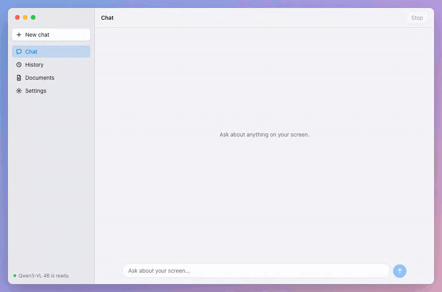
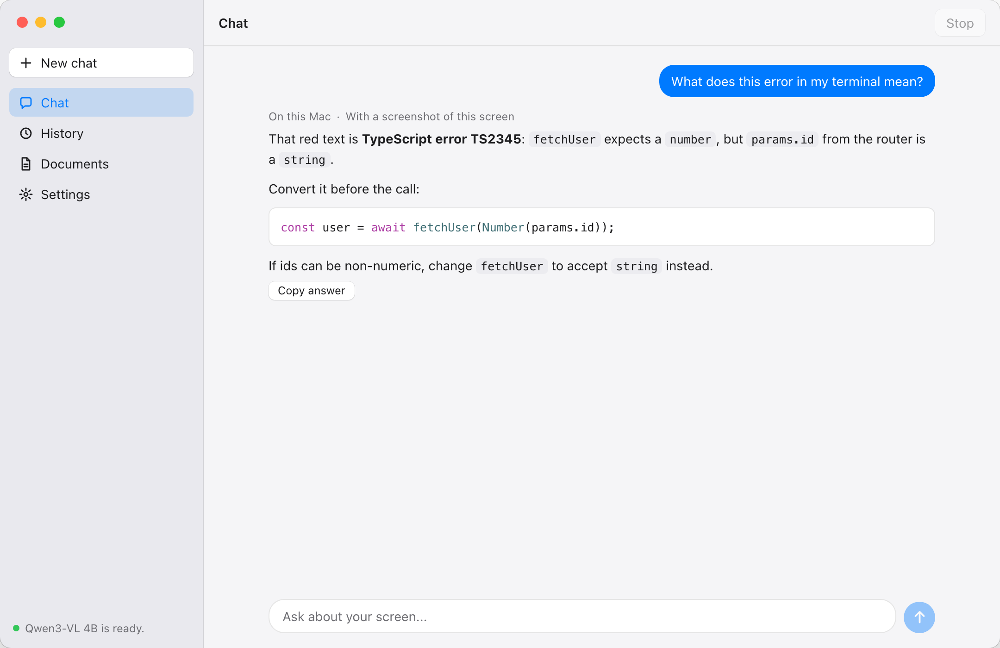
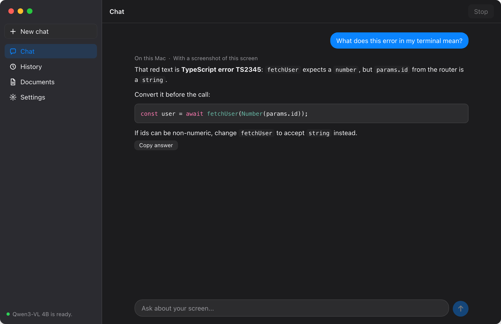
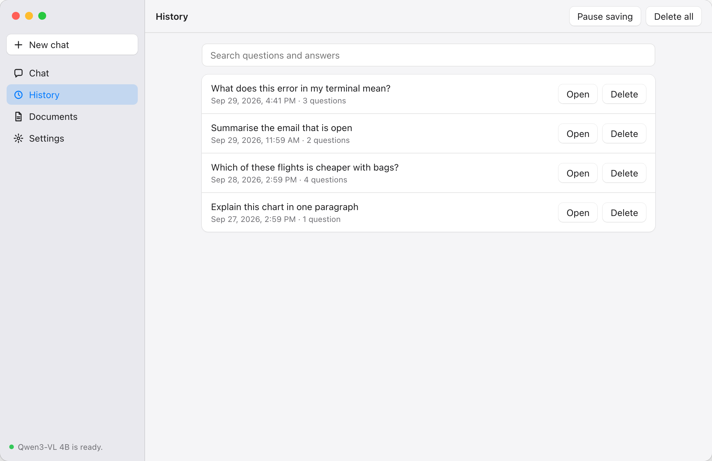
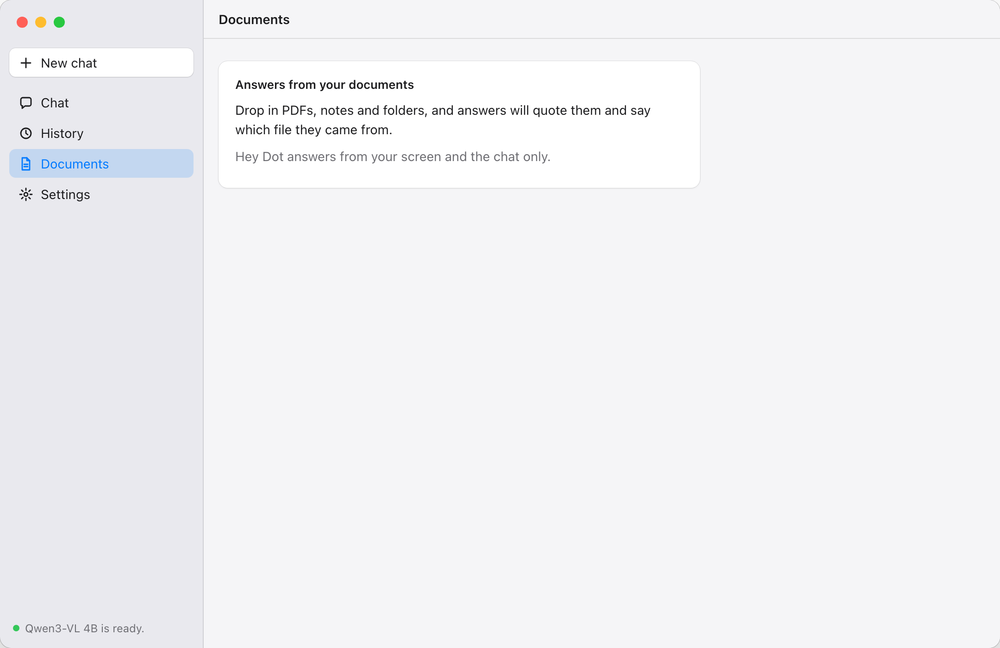
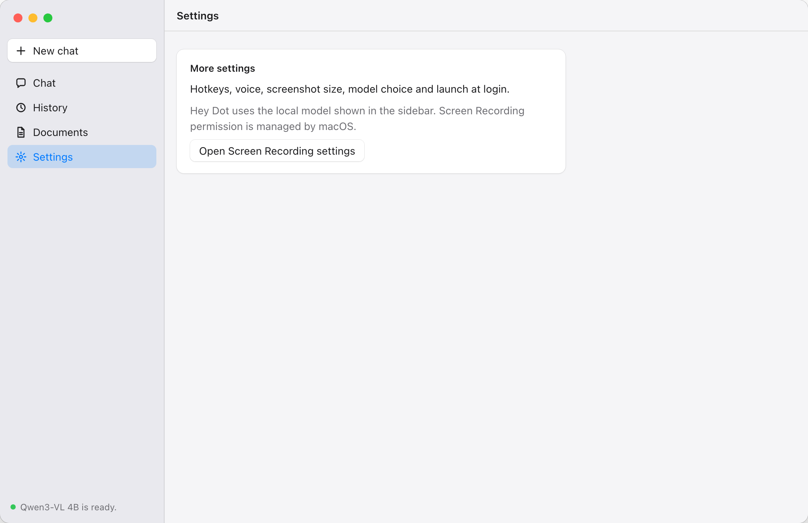

# Hey Dot

A local-first voice and screen assistant for your Mac. Ask about what is on your screen and get a spoken answer, with models that run on your machine by default.

**Status:** being rebuilt from a hackathon prototype into a full app. The original prototype is preserved at tag [`v0-hackathon`](https://github.com/Shub3am/heyDot/tree/v0-hackathon).

## Screenshots

The answers shown are examples.

| Chat | Chat, dark |
|------|------------|
|  |  |

| History | Documents | Settings |
|---------|-----------|----------|
|  |  |  |

- **Chat:** ask about your screen. Each answer says whether it stayed on this Mac and whether a screenshot went along.
- **History:** turn saving on to search, reopen and delete past chats. They are stored encrypted on this Mac.
- **Documents** and **Settings:** say what is coming, and keep the one setting that works today.

## Planned for the first release

- Push-to-talk and typed questions about your screen, answered in a chat panel and spoken aloud
- Follow-up questions within a conversation
- Local models downloaded on first run, or your own cloud API key, clearly labelled when data leaves your Mac
- "Hey Dot" wake word, tools and MCP, document Q&A in later phases

## Develop

Requirements: macOS 14 or later, Rust (via rustup; the pinned version installs itself), Node 26, pnpm 12.

    pnpm -C app install
    pnpm -C app tauri dev

See `AGENTS.md` for test and build commands.

## License

Apache-2.0. See `LICENSE`.
